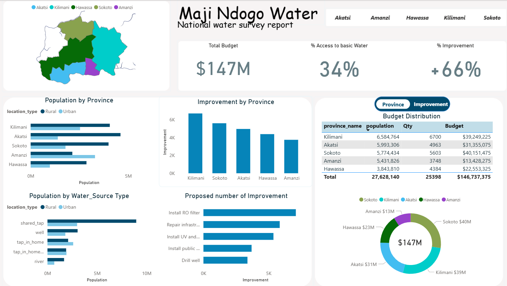
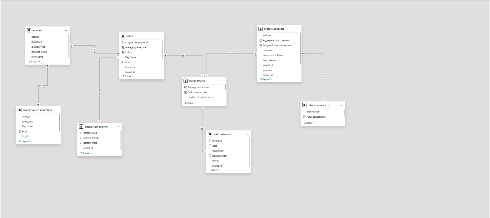
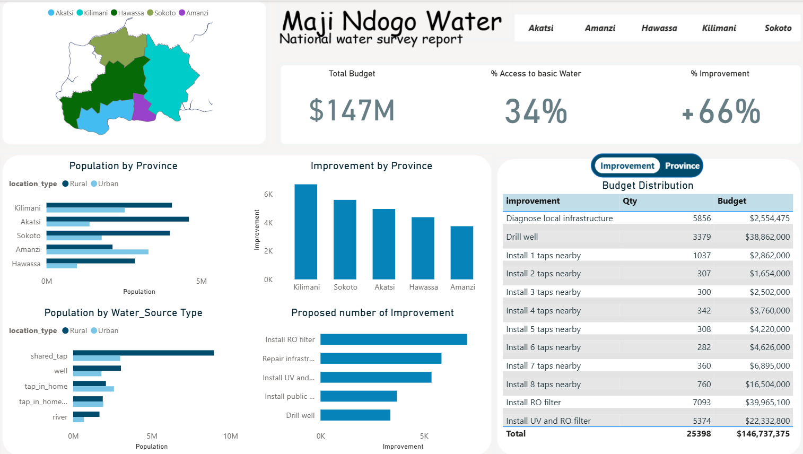

# ALX-Capstone-Project

# Water Accessibility & Budget Allocation Analysis
### A Power BI Capstone Project by Ahmed

## 📌 Project Overview
This project analyzes **water accessibility and budget allocation** across multiple provinces, uncovering key trends in **funding distribution, population impact, and infrastructure improvements**. Using **Power BI**, I developed an interactive report to present findings and support **data-driven decision-making**.

## 🛠 Technical Skills Applied
- **Power BI** – Data visualization & dashboard development
- **DAX (Data Analysis Expressions)** – Creating calculated measures & aggregations
- **Power Query** – Data cleaning & transformation for analysis
- **Data Modeling (Star Schema)** – Structuring relationships for optimized performance
- **ETL Processes** – Extract, transform & load data into a structured format

## 🔍 Dataset Overview
The dataset consists of:
- **Population Statistics** (urban vs. rural data)
- **Budget Allocations** (funding per province)
- **Water Access Levels** (% of population with basic water access)
- **Infrastructure Improvements** (completed water projects per province)

## 📊 Data Analysis Process
### 1️⃣ Data Cleaning & Preparation
- Imported raw data and cleaned inconsistencies using **Power Query**.
- Removed duplicates, handled missing values, and reformatted tables for efficient analysis.
- Created calculated columns in **DAX** to improve insights.

### 2️⃣ Data Modeling & Relationships
- Designed a **star schema**, ensuring optimal performance.
- Established **one-to-many relationships** between fact and dimension tables.
- Implemented **DAX measures** for aggregation calculations.

### 3️⃣ KPI Development & Calculations
- Used **DAX formulas** to compute:
  - **Water Access Percentage** per province
  - **Budget-to-Population Ratios**
  - **Year-over-Year Improvement Trends**
  - **Urban vs. Rural Access Disparities**
 
  

### 4️⃣ Visualization & Dashboard Design
- Developed **interactive Power BI dashboards** with:
  - **Bar charts, pie charts, maps & KPI cards** for insights.
  - **Filter options** for user-driven exploration.
  - **Province-level deep dive** into disparities.

## 📈 Key Insights & Findings
✔ **Only 34% of the population** has access to basic water, but improvements have risen **by 66%**.  
✔ **Kilimani receives the highest budget allocation ($39.2M)**, while Amanzi receives the least ($13.4M).  
✔ **Sokoto has more improvements than Akatsi**, despite similar population sizes.  
✔ Significant differences in **urban vs. rural water access** suggest a need for **funding redistribution**.

## 🚀 Project Outcome & Future Considerations
This analysis offers insights for **resource planning & policy adjustments**, but future improvements could focus on:
- **Optimizing budget distribution** based on population density.
- **Expanding predictive analytics** for future access trends.
- **Improving infrastructure planning** based on province needs.
